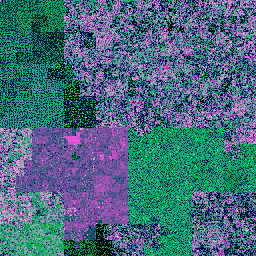
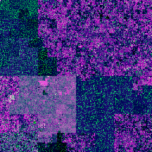

# MalVis Tool
Welcome to the MalVis, a powerful tool for visualizing Android bytecode! MalVis converts .dex files into PNG visualizations using three different methods: Entropy, MalVis-A, and MalVis-B. Each method offers unique insights into the bytecode structure. For more information about our visualization approaches, please refer to our research papers:
- **[Improving Android Malware Detection with Entropy Bytecode-to-Image Encoding Framework](https://ieeexplore.ieee.org/document/10637591)**
- **[MalVis: A Comprehensive Dataset and Framework for Improved Android Malware Visualization and Classification](https://mal-vis.org)**

## MalVis & ViCoMal Datasets
- [MalVis Dataset page](https://www.mal-vis.org)
- [ViCoMal Dataset page](https://www.mal-vis.org/ViCoMal/)

## Overview
  

## Usage

To run the tool, use the following command:

  
```sh

python main.py [options] infile [output]
```

## Options 
- `-c`, `--color`: Select a color scheme. Choose from the following MalVis representation options:
    
    - `entropy`: The entropy representation (default).
    - `malvis_a`: New approach using entropy with classbyte representation.
    - `malvis_b`: New approach using entropy with n-gram representation.
- `-q`, `--quite`: Don't show the progress bar - print the destination file name.
    
- `-s`, `--size`: Image width in pixels. The default is 256.

## Description

The MalVis tool takes a .dex file as input and generates a .png file as output. It provides three different color schemes to represent the data:

- **Entropy**: Uses the original entropy representation.
- **MalVis_A**: Uses entropy with classbyte representation.
- **MalVis_B**: Uses entropy with n-gram representation.

The tool also allows you to specify the size of the output image and whether to show a progress bar during the generation process.

## Requirements

- Python 3.x
- PIL (Python Imaging Library)

## Installation

To install the required dependencies, run:

```bash 
pip install pillow
```

## Citations
Please, if you use this tool in any of your work, cite the following papers: 

```BibTex
@inproceedings{makkawy2024improving,
  title={Improving android malware detection with entropy bytecode-to-image encoding framework},
  author={Makkawy, Saleh J and Alblwi, Abdalrahman H and De Lucia, Michael J and Barner, Kenneth E},
  booktitle={2024 33rd International Conference on Computer Communications and Networks (ICCCN)},
  pages={1--9},
  year={2024},
  organization={IEEE}
}
@article{makkawy2025malvis,
  title={MalVis: Large-Scale Bytecode Visualization Framework for Explainable Android Malware Detection},
  author={Makkawy, Saleh J and De Lucia, Michael J and Barner, Kenneth E},
  journal={Journal of Cybersecurity and Privacy},
  volume={5},
  number={4},
  pages={109},
  year={2025},
  publisher={MDPI}
}
```
## License

This project is licensed under the MIT License.


